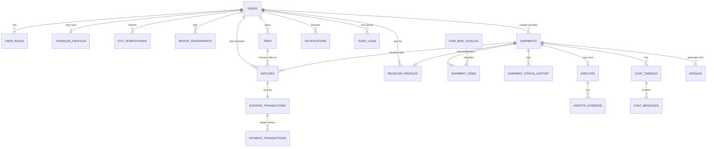

# Database Design — Cross-Border P2P Luggage Sharing Marketplace

**Version:** 1.0.0
**Stack Target:** PostgreSQL 15+, Prisma ORM, Nest.js, Redis/BullMQ (async jobs), Auth0 (identity)
**Purpose:** Canonical schema reference for implementation. Use this document as the single source of truth when generating migrations, Prisma models, or seed scripts. It resolves inconsistencies found across the original planning notes (state names, role names, item tags) into one authoritative model.

---

## 0. Design Principles (read before implementing)

1. **UUID primary keys everywhere** (`gen_random_uuid()` via `pgcrypto`) — avoids sequential-ID enumeration and works cleanly with distributed IDs / offline mobile clients.
2. **Every financially or state-sensitive table has a `version` column** (optimistic locking) to prevent race conditions when two travelers try to accept the same shipment, or when a receiver confirms delivery at the same moment the auto-release cron fires.
3. **State transitions are never free-text.** They go through Postgres `ENUM` types plus a `CHECK`-constrained transition table enforced in the application layer (Nest.js state machine service), and every transition is written to `shipment_status_history` — never overwrite, always append.
4. **Money is always integer minor units** (`BIGINT`, e.g. cents/paisa), never `FLOAT`/`NUMERIC` drift. Currency is explicit per row.
5. **Idempotency keys** on all payment-mutating tables (`escrow_transactions`, `payment_transactions`) to make webhook retries and job retries safe.
6. **Soft delete via `deleted_at`** on user-facing entities; hard delete is reserved for GDPR/right-to-erasure jobs that anonymize instead of physically deleting audit-relevant rows.
7. **One `shipments` row = one parcel = one state machine instance.** Bids/offers live in a separate `matches` table so multiple travelers can bid on one shipment without corrupting the shipment's own state.
8. **A single partial unique index** guarantees a shipment can only have one *active* accepted match at a time — this is the actual fix for the race condition class of bug ("two travelers accept the same parcel").

---

## 1. Entity-Relationship Overview



---

## 2. Enumerated Types

```sql
CREATE TYPE user_role AS ENUM (
  'SENDER', 'TRAVELER', 'RECEIVER', 'RISK_ANALYST', 'ADMIN', 'SUPER_ADMIN'
);

CREATE TYPE kyc_status AS ENUM (
  'NOT_STARTED', 'PENDING_REVIEW', 'APPROVED', 'REJECTED', 'EXPIRED'
);

CREATE TYPE kyc_document_type AS ENUM (
  'NATIONAL_ID', 'PASSPORT', 'DRIVING_LICENSE', 'SELFIE_WITH_NID',
  'SELFIE_WITH_PASSPORT', 'BOARDING_PASS', 'FLIGHT_ITINERARY'
);

CREATE TYPE item_risk_tag AS ENUM ('GREEN', 'YELLOW', 'RED');

CREATE TYPE shipment_status AS ENUM (
  'DRAFT', 'SUBMITTED', 'MATCH_PENDING', 'MATCHED', 'PAYMENT_ESCROWED',
  'PICKUP_SCHEDULED', 'PACKAGE_RECEIVED', 'IN_TRANSIT', 'ARRIVED_COUNTRY',
  'DELIVERY_SCHEDULED', 'DELIVERED', 'COMPLETED',
  'CANCELLED', 'DISPUTED', 'RETURN_INITIATED', 'RETURNED'
);

CREATE TYPE match_status AS ENUM (
  'PENDING', 'ACCEPTED', 'REJECTED', 'WITHDRAWN', 'EXPIRED', 'SUPERSEDED'
);

CREATE TYPE escrow_status AS ENUM (
  'AWAITING_FUNDING', 'FUNDED', 'RELEASED_TO_TRAVELER',
  'REFUNDED_TO_SENDER', 'PARTIALLY_REFUNDED', 'FROZEN_DISPUTE'
);

CREATE TYPE payment_txn_type AS ENUM (
  'CHARGE', 'ESCROW_HOLD', 'ESCROW_RELEASE', 'REFUND',
  'PLATFORM_FEE', 'PAYOUT', 'CHARGEBACK', 'ADJUSTMENT'
);

CREATE TYPE payment_txn_status AS ENUM (
  'PENDING', 'SUCCEEDED', 'FAILED', 'REVERSED'
);

CREATE TYPE dispute_reason AS ENUM (
  'ITEM_DAMAGED', 'ITEM_LOST', 'ITEM_NOT_DELIVERED', 'FRAUD',
  'WRONG_ITEM', 'RECEIVER_UNRESPONSIVE', 'OTHER'
);

CREATE TYPE dispute_status AS ENUM (
  'OPEN', 'UNDER_REVIEW', 'RESOLVED_SENDER', 'RESOLVED_TRAVELER',
  'RESOLVED_SPLIT', 'CLOSED_NO_ACTION'
);

CREATE TYPE notification_channel AS ENUM ('PUSH', 'SMS', 'EMAIL', 'IN_APP');

CREATE TYPE cancellation_initiator AS ENUM ('SENDER', 'TRAVELER', 'ADMIN', 'SYSTEM');
```

---

## 3. Core Tables

### 3.1 `users`
Base identity record. Auth0 owns credentials; this table owns profile + trust data.

| Column | Type | Constraints |
|---|---|---|
| id | UUID | PK, default `gen_random_uuid()` |
| auth0_sub | VARCHAR(255) | UNIQUE, NOT NULL — Auth0 `sub` claim |
| email | CITEXT | UNIQUE, NOT NULL |
| email_verified_at | TIMESTAMPTZ | NULL |
| phone_number | VARCHAR(20) | UNIQUE, NULL |
| phone_verified_at | TIMESTAMPTZ | NULL |
| full_name | VARCHAR(150) | NOT NULL |
| preferred_language | VARCHAR(5) | DEFAULT `'en'` — `en` / `ne` |
| trust_score | NUMERIC(5,2) | DEFAULT 0, CHECK (0–100) |
| account_status | VARCHAR(20) | DEFAULT `'ACTIVE'` — `ACTIVE, SUSPENDED, BANNED, PENDING_REVIEW` |
| suspension_reason | TEXT | NULL |
| created_at | TIMESTAMPTZ | DEFAULT now() |
| updated_at | TIMESTAMPTZ | DEFAULT now() |
| deleted_at | TIMESTAMPTZ | NULL (soft delete) |
| version | INT | DEFAULT 1 (optimistic lock) |

Indexes: `UNIQUE(auth0_sub)`, `UNIQUE(email)`, `idx_users_account_status`.

### 3.2 `user_roles`
Many-to-many — a user can be Sender *and* Traveler simultaneously.

| Column | Type | Constraints |
|---|---|---|
| id | UUID | PK |
| user_id | UUID | FK → users.id, NOT NULL |
| role | user_role | NOT NULL |
| granted_at | TIMESTAMPTZ | DEFAULT now() |
| granted_by | UUID | FK → users.id, NULL (system/admin who granted) |

`UNIQUE(user_id, role)`.

### 3.3 `traveler_profiles`
1:1 extension of `users` for traveler-specific state (avoids polluting `users` with nullable traveler-only columns).

| Column | Type | Constraints |
|---|---|---|
| id | UUID | PK |
| user_id | UUID | FK → users.id, UNIQUE, NOT NULL |
| kyc_status | kyc_status | DEFAULT `'NOT_STARTED'` |
| kyc_verified_at | TIMESTAMPTZ | NULL |
| kyc_expires_at | TIMESTAMPTZ | NULL — re-verification cadence |
| completed_trips_count | INT | DEFAULT 0 |
| cancellation_count | INT | DEFAULT 0 |
| is_verified_badge | BOOLEAN | DEFAULT false |
| payout_account_ref | VARCHAR(255) | NULL — tokenized payout method id (never raw bank data) |
| version | INT | DEFAULT 1 |

### 3.4 `kyc_verifications`
Append-only record of every document submission (Sender Level 1/2, Traveler deep KYC). Never update in place — new submission = new row; keeps a full audit trail for compliance.

| Column | Type | Constraints |
|---|---|---|
| id | UUID | PK |
| user_id | UUID | FK → users.id, NOT NULL |
| document_type | kyc_document_type | NOT NULL |
| document_storage_key | TEXT | NOT NULL — Cloudinary signed-URL key, never public URL |
| ocr_extracted_json | JSONB | NULL |
| status | kyc_status | DEFAULT `'PENDING_REVIEW'` |
| reviewed_by | UUID | FK → users.id, NULL (Risk Analyst / Admin) |
| reviewed_at | TIMESTAMPTZ | NULL |
| rejection_reason | TEXT | NULL |
| created_at | TIMESTAMPTZ | DEFAULT now() |

Index: `idx_kyc_user_status (user_id, status)`.

### 3.5 `device_fingerprints`
Fraud/anti-multi-accounting signal.

| Column | Type | Constraints |
|---|---|---|
| id | UUID | PK |
| user_id | UUID | FK → users.id, NOT NULL |
| device_hash | VARCHAR(255) | NOT NULL |
| ip_address | INET | NOT NULL |
| user_agent | TEXT | NULL |
| geolocation | POINT | NULL |
| first_seen_at | TIMESTAMPTZ | DEFAULT now() |
| last_seen_at | TIMESTAMPTZ | DEFAULT now() |

Index: `idx_device_hash (device_hash)` — used to detect the same device/passport hash tied to multiple `user_id`s (query pattern: `GROUP BY device_hash HAVING COUNT(DISTINCT user_id) > 1`).

### 3.6 `trips`
Traveler-posted itineraries (the supply side).

| Column | Type | Constraints |
|---|---|---|
| id | UUID | PK |
| traveler_id | UUID | FK → users.id, NOT NULL |
| departure_country | VARCHAR(2) | NOT NULL — ISO-3166 alpha-2 |
| departure_city | VARCHAR(100) | NOT NULL |
| departure_airport_code | VARCHAR(3) | NOT NULL — IATA |
| destination_country | VARCHAR(2) | NOT NULL |
| destination_city | VARCHAR(100) | NOT NULL |
| destination_airport_code | VARCHAR(3) | NOT NULL |
| departure_at | TIMESTAMPTZ | NOT NULL, CHECK > now() at insert |
| arrival_at | TIMESTAMPTZ | NOT NULL, CHECK (arrival_at > departure_at) |
| total_luggage_capacity_kg | NUMERIC(6,2) | NOT NULL |
| available_capacity_kg | NUMERIC(6,2) | NOT NULL, CHECK (available_capacity_kg >= 0) |
| price_per_kg_minor | BIGINT | NOT NULL — minor currency units |
| currency | VARCHAR(3) | NOT NULL — ISO-4217 |
| boarding_pass_storage_key | TEXT | NULL — hidden from other users, admin/risk-only |
| status | VARCHAR(20) | DEFAULT `'ACTIVE'` — `ACTIVE, LOCKED, EXPIRED, CANCELLED` |
| version | INT | DEFAULT 1 |
| created_at | TIMESTAMPTZ | DEFAULT now() |
| updated_at | TIMESTAMPTZ | DEFAULT now() |

Indexes: `idx_trips_route (departure_airport_code, destination_airport_code, departure_at)` — this is the core matching-engine lookup; `idx_trips_traveler (traveler_id, status)`.

`available_capacity_kg` is decremented transactionally whenever a `match` moves to `ACCEPTED`, and restored on cancellation — always inside a `SELECT ... FOR UPDATE` row lock to prevent oversell race conditions.

### 3.7 `item_risk_catalog`
Reference/lookup table — not user data — so risk rules are configurable without a deploy.

| Column | Type | Constraints |
|---|---|---|
| id | UUID | PK |
| tag | item_risk_tag | NOT NULL |
| category_name | VARCHAR(100) | NOT NULL |
| requires_invoice | BOOLEAN | DEFAULT false |
| requires_admin_review | BOOLEAN | DEFAULT false |
| is_prohibited | BOOLEAN | DEFAULT false |
| description | TEXT | NULL |

Seed rows cover: prohibited (drugs, weapons, explosives, gold bullion, counterfeit, alcohol/tobacco over allowance), green (clothes, books, cosmetics, supplements, chocolates), yellow (small electronics, designer goods), red (phones, laptops, cameras, prescription meds, jewelry).

### 3.8 `shipments`
One row per parcel request — the state-machine root entity (the demand side).

| Column | Type | Constraints |
|---|---|---|
| id | UUID | PK |
| sender_id | UUID | FK → users.id, NOT NULL |
| title | VARCHAR(150) | NOT NULL |
| description | TEXT | NULL |
| pickup_location | TEXT | NOT NULL |
| pickup_country | VARCHAR(2) | NOT NULL |
| delivery_location | TEXT | NOT NULL |
| delivery_country | VARCHAR(2) | NOT NULL |
| declared_weight_kg | NUMERIC(6,2) | NOT NULL, CHECK > 0 |
| reward_amount_minor | BIGINT | NOT NULL, CHECK > 0 |
| currency | VARCHAR(3) | NOT NULL |
| required_by_date | DATE | NULL |
| highest_risk_tag | item_risk_tag | NOT NULL — derived from child `shipment_items`, drives moderation gate |
| status | shipment_status | DEFAULT `'DRAFT'` NOT NULL |
| accepted_match_id | UUID | FK → matches.id, NULL — set only when status ≥ MATCHED |
| version | INT | DEFAULT 1 |
| created_at | TIMESTAMPTZ | DEFAULT now() |
| updated_at | TIMESTAMPTZ | DEFAULT now() |
| deleted_at | TIMESTAMPTZ | NULL |

Indexes: `idx_shipments_status (status)`, `idx_shipments_sender (sender_id)`, `idx_shipments_route (pickup_country, delivery_country, status)` for feed browsing.

**Race-condition guard (critical):**
```sql
CREATE UNIQUE INDEX uq_shipment_single_active_match
  ON matches (shipment_id)
  WHERE status = 'ACCEPTED';
```
This guarantees at most one `ACCEPTED` match can ever exist per shipment at the database level — even if two travelers hit "accept" within the same millisecond, only one insert/update succeeds; the second raises a unique-violation the service layer turns into a clean "already matched" response instead of double-booking.

### 3.9 `shipment_items`
A shipment can bundle multiple physical items (e.g., 2 pairs of shoes + 1 book) under one escrow.

| Column | Type | Constraints |
|---|---|---|
| id | UUID | PK |
| shipment_id | UUID | FK → shipments.id, NOT NULL |
| item_name | VARCHAR(150) | NOT NULL |
| risk_catalog_id | UUID | FK → item_risk_catalog.id, NOT NULL |
| approx_weight_kg | NUMERIC(6,2) | NOT NULL |
| declared_value_minor | BIGINT | NULL — required if risk tag = RED |
| invoice_storage_key | TEXT | NULL — required if risk tag = RED |
| photo_storage_keys | TEXT[] | NOT NULL, CHECK (array_length >= 1) |
| admin_review_status | VARCHAR(20) | DEFAULT `'NOT_REQUIRED'` — `NOT_REQUIRED, PENDING, APPROVED, REJECTED` |

### 3.10 `matches`
Bids/offers — the negotiation layer between `trips` (supply) and `shipments` (demand). Deliberately decoupled from `shipments.status` so many pending bids can coexist safely.

| Column | Type | Constraints |
|---|---|---|
| id | UUID | PK |
| shipment_id | UUID | FK → shipments.id, NOT NULL |
| trip_id | UUID | FK → trips.id, NOT NULL |
| traveler_id | UUID | FK → users.id, NOT NULL (denormalized for query speed) |
| offered_price_minor | BIGINT | NOT NULL |
| currency | VARCHAR(3) | NOT NULL |
| initiated_by | VARCHAR(20) | NOT NULL — `SENDER_PULL` or `TRAVELER_PUSH` |
| status | match_status | DEFAULT `'PENDING'` NOT NULL |
| accepted_at | TIMESTAMPTZ | NULL |
| expires_at | TIMESTAMPTZ | NULL — stale-bid auto-expiry |
| version | INT | DEFAULT 1 |
| created_at | TIMESTAMPTZ | DEFAULT now() |
| updated_at | TIMESTAMPTZ | DEFAULT now() |

Indexes: `idx_matches_shipment (shipment_id, status)`, `idx_matches_trip (trip_id, status)`.
Business rule enforced in service layer: on `ACCEPTED`, all sibling `PENDING` matches for the same `shipment_id` are transitioned to `SUPERSEDED` inside the same DB transaction as the capacity decrement on `trips.available_capacity_kg` and the `shipments.status → MATCHED` update — one atomic unit.

### 3.11 `shipment_status_history`
Append-only audit trail of the state machine. Never mutated.

| Column | Type | Constraints |
|---|---|---|
| id | UUID | PK |
| shipment_id | UUID | FK → shipments.id, NOT NULL |
| from_status | shipment_status | NULL |
| to_status | shipment_status | NOT NULL |
| triggered_by_user_id | UUID | FK → users.id, NULL (NULL = system/cron) |
| metadata | JSONB | NULL — e.g. OTP hash, photo keys, dispute id |
| created_at | TIMESTAMPTZ | DEFAULT now() |

Index: `idx_status_history_shipment (shipment_id, created_at)`.

### 3.12 `receiver_profiles`
Receivers may not be full platform users (they just collect the parcel), so this is a lightweight linked entity rather than forcing a full `users` row.

| Column | Type | Constraints |
|---|---|---|
| id | UUID | PK |
| shipment_id | UUID | FK → shipments.id, UNIQUE, NOT NULL |
| linked_user_id | UUID | FK → users.id, NULL — set if receiver has an account |
| full_name | VARCHAR(150) | NOT NULL |
| phone_number | VARCHAR(20) | NOT NULL |
| delivery_otp_hash | TEXT | NULL — hashed, never store raw OTP |
| otp_generated_at | TIMESTAMPTZ | NULL |
| otp_verified_at | TIMESTAMPTZ | NULL |
| id_photo_storage_key | TEXT | NULL — fallback proof-of-delivery if OTP unavailable |

### 3.13 `escrow_transactions`
One escrow "envelope" per accepted match. This is the ledger header; `payment_transactions` are the line items.

| Column | Type | Constraints |
|---|---|---|
| id | UUID | PK |
| match_id | UUID | FK → matches.id, UNIQUE, NOT NULL |
| shipment_id | UUID | FK → shipments.id, NOT NULL |
| gross_amount_minor | BIGINT | NOT NULL |
| platform_fee_bps | INT | NOT NULL DEFAULT 1000 — basis points, 1000 = 10% |
| platform_fee_minor | BIGINT | NOT NULL — computed at funding time, immutable after |
| traveler_payout_minor | BIGINT | NOT NULL — `gross_amount_minor - platform_fee_minor` |
| currency | VARCHAR(3) | NOT NULL |
| status | escrow_status | DEFAULT `'AWAITING_FUNDING'` NOT NULL |
| funded_at | TIMESTAMPTZ | NULL |
| release_eligible_at | TIMESTAMPTZ | NULL — flight arrival + 24h/48h auto-confirm window |
| released_at | TIMESTAMPTZ | NULL |
| idempotency_key | VARCHAR(100) | UNIQUE, NOT NULL |
| version | INT | DEFAULT 1 |
| created_at | TIMESTAMPTZ | DEFAULT now() |
| updated_at | TIMESTAMPTZ | DEFAULT now() |

Index: `idx_escrow_release_eligible (status, release_eligible_at)` — this is the exact index the BullMQ auto-confirmation cron job scans (`WHERE status = 'FUNDED' AND release_eligible_at <= now()`).

### 3.14 `payment_transactions`
Immutable ledger of every money movement — gateway charges, escrow holds/releases, refunds, fees, payouts, chargebacks. Never update a row; corrections are new offsetting rows.

| Column | Type | Constraints |
|---|---|---|
| id | UUID | PK |
| escrow_transaction_id | UUID | FK → escrow_transactions.id, NOT NULL |
| type | payment_txn_type | NOT NULL |
| status | payment_txn_status | DEFAULT `'PENDING'` NOT NULL |
| amount_minor | BIGINT | NOT NULL |
| currency | VARCHAR(3) | NOT NULL |
| gateway_reference | VARCHAR(255) | NULL — PSP transaction id |
| idempotency_key | VARCHAR(100) | UNIQUE, NOT NULL |
| failure_reason | TEXT | NULL |
| created_at | TIMESTAMPTZ | DEFAULT now() |

Index: `idx_payment_escrow (escrow_transaction_id, type)`.

### 3.15 `disputes`
| Column | Type | Constraints |
|---|---|---|
| id | UUID | PK |
| shipment_id | UUID | FK → shipments.id, NOT NULL |
| raised_by_user_id | UUID | FK → users.id, NOT NULL |
| reason | dispute_reason | NOT NULL |
| description | TEXT | NOT NULL |
| status | dispute_status | DEFAULT `'OPEN'` NOT NULL |
| assigned_admin_id | UUID | FK → users.id, NULL |
| resolution_notes | TEXT | NULL |
| resolved_at | TIMESTAMPTZ | NULL |
| created_at | TIMESTAMPTZ | DEFAULT now() |

Business rule: inserting an `OPEN` dispute for a shipment must, in the same transaction, flip `escrow_transactions.status → FROZEN_DISPUTE` for that shipment's escrow row and cancel any pending auto-release job — enforced via a Postgres trigger or a Nest.js transactional service method, not left to eventual consistency.

### 3.16 `dispute_evidence`
| Column | Type | Constraints |
|---|---|---|
| id | UUID | PK |
| dispute_id | UUID | FK → disputes.id, NOT NULL |
| uploaded_by_user_id | UUID | FK → users.id, NOT NULL |
| evidence_type | VARCHAR(20) | `PHOTO, CHAT_EXPORT, DOCUMENT` |
| storage_key | TEXT | NOT NULL |
| created_at | TIMESTAMPTZ | DEFAULT now() |

### 3.17 `ratings`
Two rows generated per completed shipment (sender→traveler, traveler→sender).

| Column | Type | Constraints |
|---|---|---|
| id | UUID | PK |
| shipment_id | UUID | FK → shipments.id, NOT NULL |
| rater_user_id | UUID | FK → users.id, NOT NULL |
| ratee_user_id | UUID | FK → users.id, NOT NULL |
| stars | SMALLINT | NOT NULL, CHECK (stars BETWEEN 1 AND 5) |
| comment | TEXT | NULL |
| created_at | TIMESTAMPTZ | DEFAULT now() |

`UNIQUE(shipment_id, rater_user_id)` — one rating per rater per shipment.

### 3.18 `chat_threads` / `chat_messages`
| `chat_threads` | Type | Constraints |
|---|---|---|
| id | UUID | PK |
| shipment_id | UUID | FK → shipments.id, UNIQUE, NOT NULL |
| opened_at | TIMESTAMPTZ | DEFAULT now() |
| locked_at | TIMESTAMPTZ | NULL — locked once shipment reaches terminal state |

| `chat_messages` | Type | Constraints |
|---|---|---|
| id | UUID | PK |
| thread_id | UUID | FK → chat_threads.id, NOT NULL |
| sender_id | UUID | FK → users.id, NOT NULL |
| body | TEXT | NOT NULL |
| flagged_reason | VARCHAR(50) | NULL — `EXTERNAL_CONTACT_DETECTED`, `PAYMENT_BYPASS_DETECTED` |
| is_hidden | BOOLEAN | DEFAULT false |
| created_at | TIMESTAMPTZ | DEFAULT now() |

Index: `idx_chat_messages_thread (thread_id, created_at)`. Content-filter regex (phone numbers, WhatsApp/Telegram links, wallet handles) runs at the Nest.js service layer before insert; flagged messages are stored with `is_hidden = true` and surfaced to moderation, never silently dropped (needed as dispute evidence).

### 3.19 `notifications`
| Column | Type | Constraints |
|---|---|---|
| id | UUID | PK |
| user_id | UUID | FK → users.id, NOT NULL |
| channel | notification_channel | NOT NULL |
| template_key | VARCHAR(100) | NOT NULL |
| payload | JSONB | NOT NULL |
| sent_at | TIMESTAMPTZ | NULL |
| read_at | TIMESTAMPTZ | NULL |
| created_at | TIMESTAMPTZ | DEFAULT now() |

Index: `idx_notifications_user_unread (user_id) WHERE read_at IS NULL`.

### 3.20 `audit_logs`
System-wide immutable audit trail (KYC decisions, escrow overrides, bans, dispute rulings).

| Column | Type | Constraints |
|---|---|---|
| id | UUID | PK |
| actor_user_id | UUID | FK → users.id, NULL (NULL = system) |
| action | VARCHAR(100) | NOT NULL — e.g. `ESCROW_MANUAL_OVERRIDE`, `USER_BANNED` |
| entity_type | VARCHAR(50) | NOT NULL |
| entity_id | UUID | NOT NULL |
| before_state | JSONB | NULL |
| after_state | JSONB | NULL |
| ip_address | INET | NULL |
| created_at | TIMESTAMPTZ | DEFAULT now() |

Index: `idx_audit_entity (entity_type, entity_id)`.

---

## 4. Key Constraints Recap (copy into migration review checklist)

- [ ] `uq_shipment_single_active_match` partial unique index — prevents double-accept race condition.
- [ ] All money columns `BIGINT` minor units, never float.
- [ ] `trips.available_capacity_kg` mutated only inside `SELECT ... FOR UPDATE` transactions.
- [ ] `escrow_transactions.idempotency_key` and `payment_transactions.idempotency_key` both `UNIQUE`.
- [ ] Dispute creation trigger freezes escrow and cancels the release cron job atomically.
- [ ] `shipment_status_history` is INSERT-only — revoke UPDATE/DELETE at the DB role level in production.
- [ ] `audit_logs` and `payment_transactions` are INSERT-only for the application DB role.
- [ ] Every table with concurrent-writer risk (`users`, `traveler_profiles`, `trips`, `shipments`, `matches`, `escrow_transactions`) carries a `version` column checked on every UPDATE (`WHERE id = ? AND version = ?`), bumped `version = version + 1`.

---

## 5. Prisma Schema (drop-in starting point)

```prisma
datasource db {
  provider = "postgresql"
  url      = env("DATABASE_URL")
}

generator client {
  provider = "prisma-client-js"
}

enum UserRole { SENDER TRAVELER RECEIVER RISK_ANALYST ADMIN SUPER_ADMIN }
enum KycStatus { NOT_STARTED PENDING_REVIEW APPROVED REJECTED EXPIRED }
enum ItemRiskTag { GREEN YELLOW RED }
enum ShipmentStatus {
  DRAFT SUBMITTED MATCH_PENDING MATCHED PAYMENT_ESCROWED
  PICKUP_SCHEDULED PACKAGE_RECEIVED IN_TRANSIT ARRIVED_COUNTRY
  DELIVERY_SCHEDULED DELIVERED COMPLETED
  CANCELLED DISPUTED RETURN_INITIATED RETURNED
}
enum MatchStatus { PENDING ACCEPTED REJECTED WITHDRAWN EXPIRED SUPERSEDED }
enum EscrowStatus {
  AWAITING_FUNDING FUNDED RELEASED_TO_TRAVELER
  REFUNDED_TO_SENDER PARTIALLY_REFUNDED FROZEN_DISPUTE
}
enum PaymentTxnType { CHARGE ESCROW_HOLD ESCROW_RELEASE REFUND PLATFORM_FEE PAYOUT CHARGEBACK ADJUSTMENT }
enum PaymentTxnStatus { PENDING SUCCEEDED FAILED REVERSED }
enum DisputeReason { ITEM_DAMAGED ITEM_LOST ITEM_NOT_DELIVERED FRAUD WRONG_ITEM RECEIVER_UNRESPONSIVE OTHER }
enum DisputeStatus { OPEN UNDER_REVIEW RESOLVED_SENDER RESOLVED_TRAVELER RESOLVED_SPLIT CLOSED_NO_ACTION }

model User {
  id               String   @id @default(uuid())
  auth0Sub         String   @unique @map("auth0_sub")
  email            String   @unique
  emailVerifiedAt  DateTime? @map("email_verified_at")
  phoneNumber      String?  @unique @map("phone_number")
  phoneVerifiedAt  DateTime? @map("phone_verified_at")
  fullName         String   @map("full_name")
  preferredLanguage String  @default("en") @map("preferred_language")
  trustScore       Decimal  @default(0) @map("trust_score")
  accountStatus    String   @default("ACTIVE") @map("account_status")
  version          Int      @default(1)
  createdAt        DateTime @default(now()) @map("created_at")
  updatedAt        DateTime @updatedAt @map("updated_at")
  deletedAt        DateTime? @map("deleted_at")

  roles            UserRoleAssignment[]
  travelerProfile  TravelerProfile?
  kycSubmissions   KycVerification[]
  trips            Trip[]
  shipmentsAsSender Shipment[] @relation("SenderShipments")
  matchesAsTraveler Match[]
  auditLogs        AuditLog[]

  @@map("users")
}

model UserRoleAssignment {
  id        String   @id @default(uuid())
  userId    String   @map("user_id")
  role      UserRole
  grantedAt DateTime @default(now()) @map("granted_at")
  user      User     @relation(fields: [userId], references: [id])

  @@unique([userId, role])
  @@map("user_roles")
}

model TravelerProfile {
  id                    String    @id @default(uuid())
  userId                String    @unique @map("user_id")
  kycStatus             KycStatus @default(NOT_STARTED) @map("kyc_status")
  kycVerifiedAt         DateTime? @map("kyc_verified_at")
  completedTripsCount   Int       @default(0) @map("completed_trips_count")
  cancellationCount     Int       @default(0) @map("cancellation_count")
  isVerifiedBadge       Boolean   @default(false) @map("is_verified_badge")
  version               Int       @default(1)
  user                  User      @relation(fields: [userId], references: [id])

  @@map("traveler_profiles")
}

model KycVerification {
  id               String     @id @default(uuid())
  userId           String     @map("user_id")
  documentType     String     @map("document_type")
  documentStorageKey String   @map("document_storage_key")
  status           KycStatus  @default(PENDING_REVIEW)
  reviewedBy       String?    @map("reviewed_by")
  reviewedAt       DateTime?  @map("reviewed_at")
  createdAt        DateTime   @default(now()) @map("created_at")
  user             User       @relation(fields: [userId], references: [id])

  @@index([userId, status])
  @@map("kyc_verifications")
}

model Trip {
  id                     String   @id @default(uuid())
  travelerId             String   @map("traveler_id")
  departureAirportCode   String   @map("departure_airport_code")
  destinationAirportCode String   @map("destination_airport_code")
  departureAt            DateTime @map("departure_at")
  arrivalAt              DateTime @map("arrival_at")
  totalLuggageCapacityKg Decimal  @map("total_luggage_capacity_kg")
  availableCapacityKg    Decimal  @map("available_capacity_kg")
  pricePerKgMinor        BigInt   @map("price_per_kg_minor")
  currency               String
  status                 String   @default("ACTIVE")
  version                Int      @default(1)
  createdAt              DateTime @default(now()) @map("created_at")

  traveler User    @relation(fields: [travelerId], references: [id])
  matches  Match[]

  @@index([departureAirportCode, destinationAirportCode, departureAt])
  @@map("trips")
}

model Shipment {
  id               String         @id @default(uuid())
  senderId         String         @map("sender_id")
  title            String
  declaredWeightKg Decimal        @map("declared_weight_kg")
  rewardAmountMinor BigInt        @map("reward_amount_minor")
  currency         String
  highestRiskTag   ItemRiskTag    @map("highest_risk_tag")
  status           ShipmentStatus @default(DRAFT)
  acceptedMatchId  String?        @unique @map("accepted_match_id")
  version          Int            @default(1)
  createdAt        DateTime       @default(now()) @map("created_at")
  updatedAt        DateTime       @updatedAt @map("updated_at")
  deletedAt        DateTime?      @map("deleted_at")

  sender         User                     @relation("SenderShipments", fields: [senderId], references: [id])
  items          ShipmentItem[]
  matches        Match[]
  statusHistory  ShipmentStatusHistory[]
  receiver       ReceiverProfile?
  disputes       Dispute[]
  chatThread     ChatThread?
  ratings        Rating[]

  @@index([status])
  @@map("shipments")
}

model ShipmentItem {
  id                 String   @id @default(uuid())
  shipmentId         String   @map("shipment_id")
  itemName           String   @map("item_name")
  riskTag            ItemRiskTag @map("risk_tag")
  approxWeightKg     Decimal  @map("approx_weight_kg")
  declaredValueMinor BigInt?  @map("declared_value_minor")
  photoStorageKeys   String[] @map("photo_storage_keys")

  shipment Shipment @relation(fields: [shipmentId], references: [id])

  @@map("shipment_items")
}

model Match {
  id               String      @id @default(uuid())
  shipmentId       String      @map("shipment_id")
  tripId           String      @map("trip_id")
  travelerId       String      @map("traveler_id")
  offeredPriceMinor BigInt     @map("offered_price_minor")
  currency         String
  status           MatchStatus @default(PENDING)
  acceptedAt       DateTime?   @map("accepted_at")
  version          Int         @default(1)
  createdAt        DateTime    @default(now()) @map("created_at")

  shipment Shipment @relation(fields: [shipmentId], references: [id])
  trip     Trip     @relation(fields: [tripId], references: [id])
  traveler User     @relation(fields: [travelerId], references: [id])
  escrow   EscrowTransaction?

  @@index([shipmentId, status])
  @@index([tripId, status])
  @@map("matches")
}

model ShipmentStatusHistory {
  id            String          @id @default(uuid())
  shipmentId    String          @map("shipment_id")
  fromStatus    ShipmentStatus? @map("from_status")
  toStatus      ShipmentStatus  @map("to_status")
  triggeredById String?         @map("triggered_by_user_id")
  metadata      Json?
  createdAt     DateTime        @default(now()) @map("created_at")

  shipment Shipment @relation(fields: [shipmentId], references: [id])

  @@index([shipmentId, createdAt])
  @@map("shipment_status_history")
}

model ReceiverProfile {
  id               String    @id @default(uuid())
  shipmentId       String    @unique @map("shipment_id")
  fullName         String    @map("full_name")
  phoneNumber      String    @map("phone_number")
  deliveryOtpHash  String?   @map("delivery_otp_hash")
  otpVerifiedAt    DateTime? @map("otp_verified_at")

  shipment Shipment @relation(fields: [shipmentId], references: [id])

  @@map("receiver_profiles")
}

model EscrowTransaction {
  id                    String       @id @default(uuid())
  matchId                String       @unique @map("match_id")
  grossAmountMinor       BigInt       @map("gross_amount_minor")
  platformFeeBps         Int          @default(1000) @map("platform_fee_bps")
  platformFeeMinor       BigInt       @map("platform_fee_minor")
  travelerPayoutMinor    BigInt       @map("traveler_payout_minor")
  currency               String
  status                 EscrowStatus @default(AWAITING_FUNDING)
  releaseEligibleAt      DateTime?    @map("release_eligible_at")
  releasedAt             DateTime?    @map("released_at")
  idempotencyKey         String       @unique @map("idempotency_key")
  version                Int          @default(1)
  createdAt              DateTime     @default(now()) @map("created_at")

  match        Match                @relation(fields: [matchId], references: [id])
  transactions PaymentTransaction[]

  @@index([status, releaseEligibleAt])
  @@map("escrow_transactions")
}

model PaymentTransaction {
  id                  String            @id @default(uuid())
  escrowTransactionId String            @map("escrow_transaction_id")
  type                PaymentTxnType
  status              PaymentTxnStatus  @default(PENDING)
  amountMinor         BigInt            @map("amount_minor")
  currency            String
  gatewayReference    String?           @map("gateway_reference")
  idempotencyKey      String            @unique @map("idempotency_key")
  createdAt           DateTime          @default(now()) @map("created_at")

  escrow EscrowTransaction @relation(fields: [escrowTransactionId], references: [id])

  @@index([escrowTransactionId, type])
  @@map("payment_transactions")
}

model Dispute {
  id             String        @id @default(uuid())
  shipmentId     String        @map("shipment_id")
  raisedByUserId String        @map("raised_by_user_id")
  reason         DisputeReason
  description    String
  status         DisputeStatus @default(OPEN)
  assignedAdminId String?      @map("assigned_admin_id")
  resolvedAt     DateTime?     @map("resolved_at")
  createdAt      DateTime      @default(now()) @map("created_at")

  shipment Shipment          @relation(fields: [shipmentId], references: [id])
  evidence DisputeEvidence[]

  @@map("disputes")
}

model DisputeEvidence {
  id            String   @id @default(uuid())
  disputeId     String   @map("dispute_id")
  evidenceType  String   @map("evidence_type")
  storageKey    String   @map("storage_key")
  createdAt     DateTime @default(now()) @map("created_at")

  dispute Dispute @relation(fields: [disputeId], references: [id])

  @@map("dispute_evidence")
}

model Rating {
  id           String   @id @default(uuid())
  shipmentId   String   @map("shipment_id")
  raterUserId  String   @map("rater_user_id")
  rateeUserId  String   @map("ratee_user_id")
  stars        Int
  comment      String?
  createdAt    DateTime @default(now()) @map("created_at")

  shipment Shipment @relation(fields: [shipmentId], references: [id])

  @@unique([shipmentId, raterUserId])
  @@map("ratings")
}

model ChatThread {
  id         String    @id @default(uuid())
  shipmentId String    @unique @map("shipment_id")
  openedAt   DateTime  @default(now()) @map("opened_at")
  lockedAt   DateTime? @map("locked_at")

  shipment Shipment      @relation(fields: [shipmentId], references: [id])
  messages ChatMessage[]

  @@map("chat_threads")
}

model ChatMessage {
  id            String   @id @default(uuid())
  threadId      String   @map("thread_id")
  senderId      String   @map("sender_id")
  body          String
  flaggedReason String?  @map("flagged_reason")
  isHidden      Boolean  @default(false) @map("is_hidden")
  createdAt     DateTime @default(now()) @map("created_at")

  thread ChatThread @relation(fields: [threadId], references: [id])

  @@index([threadId, createdAt])
  @@map("chat_messages")
}

model AuditLog {
  id            String   @id @default(uuid())
  actorUserId   String?  @map("actor_user_id")
  action        String
  entityType    String   @map("entity_type")
  entityId      String   @map("entity_id")
  beforeState   Json?    @map("before_state")
  afterState    Json?    @map("after_state")
  createdAt     DateTime @default(now()) @map("created_at")

  actor User? @relation(fields: [actorUserId], references: [id])

  @@index([entityType, entityId])
  @@map("audit_logs")
}
```

---

## 6. Auto-Confirmation Job Query (Redis/BullMQ + Postgres)

The exact query the recurring worker should run, using the index from §3.13:

```sql
SELECT et.id, et.match_id
FROM escrow_transactions et
WHERE et.status = 'FUNDED'
  AND et.release_eligible_at <= now()
FOR UPDATE SKIP LOCKED
LIMIT 100;
```

`FOR UPDATE SKIP LOCKED` is the key concurrency primitive: if a receiver confirms delivery via the API in the exact same instant the cron sweeps this row, whichever transaction grabs the row lock first wins, and the other silently skips it instead of deadlocking or double-releasing funds. Follow with an application-level check that `status` is still `FUNDED` before transitioning to `RELEASED_TO_TRAVELER`, and re-verify no `OPEN`/`UNDER_REVIEW` dispute exists on the parent shipment before releasing.

---

## 7. Suggested Migration Order

1. Extensions: `pgcrypto`, `citext`.
2. Enums (§2).
3. `users`, `user_roles`, `traveler_profiles`, `kyc_verifications`, `device_fingerprints`.
4. `item_risk_catalog` (+ seed data).
5. `trips`.
6. `shipments`, `shipment_items`, `receiver_profiles`.
7. `matches` (+ the partial unique index from §3.8 — do not skip this).
8. `escrow_transactions`, `payment_transactions`.
9. `disputes`, `dispute_evidence`.
10. `ratings`, `chat_threads`, `chat_messages`.
11. `shipment_status_history`, `notifications`, `audit_logs`.
12. Row-level DB role grants: revoke `UPDATE`/`DELETE` on `shipment_status_history`, `audit_logs`, `payment_transactions` for the application role; grant only `INSERT`/`SELECT`.

---

## 8. Open Items to Resolve Before Production (from source notes)

These were ambiguous or contradictory in the original planning notes and are flagged so they get an explicit product decision before launch, rather than being silently assumed by the schema:

1. **Auto-confirmation window:** notes say "24-48 hr" — pick one fixed value (recommend 48h) and store it as a config row, not a hardcoded constant, so it can change per corridor/country without a migration.
2. **Commission rate:** notes mention both 10% and a 10–15% range — schema stores `platform_fee_bps` per-transaction (not global) specifically so this can vary by risk tier or promotion without a schema change.
3. **RED tag items:** notes are inconsistent about whether gold/jewelry are prohibited or red-tag-with-review. Current schema treats raw bullion as `is_prohibited = true` in `item_risk_catalog` and finished jewelry as `RED` (review required) — confirm with legal/compliance before seeding.
4. **Receiver accounts:** notes don't clarify if receivers need full accounts. Schema supports both (`receiver_profiles.linked_user_id` nullable) — decide whether OTP-only anonymous receivers are permanently allowed or only a v1 shortcut.
5. **Multi-item vs single-item shipments:** notes mix "item" and "shipment" language. Schema treats a shipment as a bundle (`shipment_items` 1-to-many) — confirm this matches intended UX (one listing per parcel bag, not per physical object).
